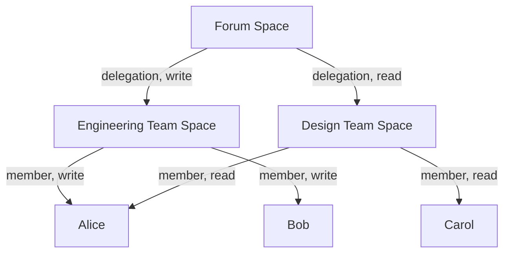

<Callout type="error" title="Experimental">
This API is experimental and will change. See the [Permissioned Spaces overview](../spaces.md) for context.
</Callout>

Membership determines who can read and write within a space. Members have one of three access levels — `write`, `read`, or `read_self`. Write implies read. `read_self` restricts the member to reading only their own records within the space.

## Adding a member

Only the space authority or a super admin can add members.

```ts tab="TypeScript" tab-group="language"
const response = await fetch("https://happyview.example.com/xrpc/com.atproto.simplespace.addMember", {
  method: "POST",
  headers: {
    "X-Client-Key": CLIENT_KEY,
    "Authorization": `DPoP ${ACCESS_TOKEN}`,
    "DPoP": DPOP_PROOF,
    "Content-Type": "application/json",
  },
  body: JSON.stringify({
    space: "ats://did:plc:abc123/com.example.forum/main",
    did: "did:plc:newmember",
    access: "write",
    isDelegation: false,
  }),
});
interface Member {
  id: string;
  spaceId: string;
  did: string;
  access: string;
  isDelegation: boolean;
  grantedBy: string;
  createdAt: string;
}
const data: { member: Member } = await response.json();
```
```js tab="JavaScript" tab-group="language"
const response = await fetch("https://happyview.example.com/xrpc/com.atproto.simplespace.addMember", {
  method: "POST",
  headers: {
    "X-Client-Key": CLIENT_KEY,
    "Authorization": `DPoP ${ACCESS_TOKEN}`,
    "DPoP": DPOP_PROOF,
    "Content-Type": "application/json",
  },
  body: JSON.stringify({
    space: "ats://did:plc:abc123/com.example.forum/main",
    did: "did:plc:newmember",
    access: "write",
    isDelegation: false,
  }),
});
const data = await response.json();
```
```rust tab="Rust" tab-group="language"
let response = client
    .post("https://happyview.example.com/xrpc/com.atproto.simplespace.addMember")
    .header("X-Client-Key", client_key)
    .header("Authorization", format!("DPoP {}", access_token))
    .header("DPoP", &dpop_proof)
    .json(&serde_json::json!({
        "space": "ats://did:plc:abc123/com.example.forum/main",
        "did": "did:plc:newmember",
        "access": "write",
        "isDelegation": false
    }))
    .send()
    .await?;
let data: serde_json::Value = response.json().await?;
```
```go tab="Go" tab-group="language"
body := bytes.NewBufferString(`{
  "space": "ats://did:plc:abc123/com.example.forum/main",
  "did": "did:plc:newmember",
  "access": "write",
  "isDelegation": false
}`)
req, _ := http.NewRequest("POST",
  "https://happyview.example.com/xrpc/com.atproto.simplespace.addMember", body)
req.Header.Set("X-Client-Key", clientKey)
req.Header.Set("Authorization", "DPoP "+accessToken)
req.Header.Set("DPoP", dpopProof)
req.Header.Set("Content-Type", "application/json")
resp, err := http.DefaultClient.Do(req)
```
```sh tab="cURL" tab-group="language"
curl -X POST 'https://happyview.example.com/xrpc/com.atproto.simplespace.addMember' \
  -H 'X-Client-Key: hvc_...' \
  -H 'Authorization: DPoP <token>' \
  -H 'DPoP: <proof>' \
  -H 'Content-Type: application/json' \
  -d '{
    "space": "ats://did:plc:abc123/com.example.forum/main",
    "did": "did:plc:newmember",
    "access": "write",
    "isDelegation": false
  }'
```

**Input:**

| Field | Type | Required | Default | Description |
|---|---|---|---|---|
| `space` | string | Yes | | The space to add the member to |
| `did` | string | Yes | | DID of the member (or space for delegation) |
| `access` | string | No | `read` | `read`, `read_self`, or `write` |
| `isDelegation` | boolean | No | `false` | Whether this member is a delegated space |

**Response (201):**

```json
{
  "member": {
    "id": "uuid",
    "spaceId": "space-uuid",
    "did": "did:plc:newmember",
    "access": "write",
    "isDelegation": false,
    "grantedBy": "did:plc:abc123",
    "createdAt": "2026-05-09T12:00:00Z"
  }
}
```

## Removing a member

```ts tab="TypeScript" tab-group="language"
const response = await fetch("https://happyview.example.com/xrpc/com.atproto.simplespace.removeMember", {
  method: "POST",
  headers: {
    "X-Client-Key": CLIENT_KEY,
    "Authorization": `DPoP ${ACCESS_TOKEN}`,
    "DPoP": DPOP_PROOF,
    "Content-Type": "application/json",
  },
  body: JSON.stringify({
    space: "ats://did:plc:abc123/com.example.forum/main",
    did: "did:plc:newmember",
  }),
});
```
```js tab="JavaScript" tab-group="language"
const response = await fetch("https://happyview.example.com/xrpc/com.atproto.simplespace.removeMember", {
  method: "POST",
  headers: {
    "X-Client-Key": CLIENT_KEY,
    "Authorization": `DPoP ${ACCESS_TOKEN}`,
    "DPoP": DPOP_PROOF,
    "Content-Type": "application/json",
  },
  body: JSON.stringify({
    space: "ats://did:plc:abc123/com.example.forum/main",
    did: "did:plc:newmember",
  }),
});
```
```rust tab="Rust" tab-group="language"
let response = client
    .post("https://happyview.example.com/xrpc/com.atproto.simplespace.removeMember")
    .header("X-Client-Key", client_key)
    .header("Authorization", format!("DPoP {}", access_token))
    .header("DPoP", &dpop_proof)
    .json(&serde_json::json!({
        "space": "ats://did:plc:abc123/com.example.forum/main",
        "did": "did:plc:newmember"
    }))
    .send()
    .await?;
```
```go tab="Go" tab-group="language"
body := bytes.NewBufferString(`{
  "space": "ats://did:plc:abc123/com.example.forum/main",
  "did": "did:plc:newmember"
}`)
req, _ := http.NewRequest("POST",
  "https://happyview.example.com/xrpc/com.atproto.simplespace.removeMember", body)
req.Header.Set("X-Client-Key", clientKey)
req.Header.Set("Authorization", "DPoP "+accessToken)
req.Header.Set("DPoP", dpopProof)
req.Header.Set("Content-Type", "application/json")
resp, err := http.DefaultClient.Do(req)
```
```sh tab="cURL" tab-group="language"
curl -X POST 'https://happyview.example.com/xrpc/com.atproto.simplespace.removeMember' \
  -H 'X-Client-Key: hvc_...' \
  -H 'Authorization: DPoP <token>' \
  -H 'DPoP: <proof>' \
  -H 'Content-Type: application/json' \
  -d '{
    "space": "ats://did:plc:abc123/com.example.forum/main",
    "did": "did:plc:newmember"
  }'
```

## Listing members

```ts tab="TypeScript" tab-group="language"
const response = await fetch(
  "https://happyview.example.com/xrpc/com.atproto.simplespace.listMembers?space=ats://did:plc:abc123/com.example.forum/main",
  {
    headers: {
      "X-Client-Key": CLIENT_KEY,
      "Authorization": `DPoP ${ACCESS_TOKEN}`,
      "DPoP": DPOP_PROOF,
    },
  },
);
interface ResolvedMember {
  did: string;
  access: string;
}
const data: { members: ResolvedMember[] } = await response.json();
```
```js tab="JavaScript" tab-group="language"
const response = await fetch(
  "https://happyview.example.com/xrpc/com.atproto.simplespace.listMembers?space=ats://did:plc:abc123/com.example.forum/main",
  {
    headers: {
      "X-Client-Key": CLIENT_KEY,
      "Authorization": `DPoP ${ACCESS_TOKEN}`,
      "DPoP": DPOP_PROOF,
    },
  },
);
const data = await response.json();
```
```rust tab="Rust" tab-group="language"
let response = client
    .get("https://happyview.example.com/xrpc/com.atproto.simplespace.listMembers")
    .query(&[("space", "ats://did:plc:abc123/com.example.forum/main")])
    .header("X-Client-Key", client_key)
    .header("Authorization", format!("DPoP {}", access_token))
    .header("DPoP", &dpop_proof)
    .send()
    .await?;
let data: serde_json::Value = response.json().await?;
```
```go tab="Go" tab-group="language"
req, _ := http.NewRequest("GET",
  "https://happyview.example.com/xrpc/com.atproto.simplespace.listMembers?space=ats://did:plc:abc123/com.example.forum/main",
  nil)
req.Header.Set("X-Client-Key", clientKey)
req.Header.Set("Authorization", "DPoP "+accessToken)
req.Header.Set("DPoP", dpopProof)
resp, err := http.DefaultClient.Do(req)
```
```sh tab="cURL" tab-group="language"
curl 'https://happyview.example.com/xrpc/com.atproto.simplespace.listMembers?space=ats://did:plc:abc123/com.example.forum/main' \
  -H 'X-Client-Key: hvc_...' \
  -H 'Authorization: DPoP <token>' \
  -H 'DPoP: <proof>'
```

If the space's `membershipPublic` config is `true`, this endpoint is accessible without authentication. Otherwise, the caller must be authenticated and be a member.

The response returns the **resolved** member list — delegation chains are traversed and flattened:

```json
{
  "members": [
    { "did": "did:plc:abc123", "access": "write" },
    { "did": "did:plc:newmember", "access": "write" },
    { "did": "did:plc:delegated-user", "access": "read" }
  ]
}
```

## Delegation

A space can be added as a member of another space by setting `isDelegation: true`. This transitively grants access to all members of the delegated space.

```ts tab="TypeScript" tab-group="language"
const response = await fetch("https://happyview.example.com/xrpc/com.atproto.simplespace.addMember", {
  method: "POST",
  headers: {
    "X-Client-Key": CLIENT_KEY,
    "Authorization": `DPoP ${ACCESS_TOKEN}`,
    "DPoP": DPOP_PROOF,
    "Content-Type": "application/json",
  },
  body: JSON.stringify({
    space: "ats://did:plc:abc123/com.example.forum/main",
    did: "ats://did:plc:org/com.example.team/engineering",
    access: "read",
    isDelegation: true,
  }),
});
```
```js tab="JavaScript" tab-group="language"
const response = await fetch("https://happyview.example.com/xrpc/com.atproto.simplespace.addMember", {
  method: "POST",
  headers: {
    "X-Client-Key": CLIENT_KEY,
    "Authorization": `DPoP ${ACCESS_TOKEN}`,
    "DPoP": DPOP_PROOF,
    "Content-Type": "application/json",
  },
  body: JSON.stringify({
    space: "ats://did:plc:abc123/com.example.forum/main",
    did: "ats://did:plc:org/com.example.team/engineering",
    access: "read",
    isDelegation: true,
  }),
});
```
```rust tab="Rust" tab-group="language"
let response = client
    .post("https://happyview.example.com/xrpc/com.atproto.simplespace.addMember")
    .header("X-Client-Key", client_key)
    .header("Authorization", format!("DPoP {}", access_token))
    .header("DPoP", &dpop_proof)
    .json(&serde_json::json!({
        "space": "ats://did:plc:abc123/com.example.forum/main",
        "did": "ats://did:plc:org/com.example.team/engineering",
        "access": "read",
        "isDelegation": true
    }))
    .send()
    .await?;
```
```go tab="Go" tab-group="language"
body := bytes.NewBufferString(`{
  "space": "ats://did:plc:abc123/com.example.forum/main",
  "did": "ats://did:plc:org/com.example.team/engineering",
  "access": "read",
  "isDelegation": true
}`)
req, _ := http.NewRequest("POST",
  "https://happyview.example.com/xrpc/com.atproto.simplespace.addMember", body)
req.Header.Set("X-Client-Key", clientKey)
req.Header.Set("Authorization", "DPoP "+accessToken)
req.Header.Set("DPoP", dpopProof)
req.Header.Set("Content-Type", "application/json")
resp, err := http.DefaultClient.Do(req)
```
```sh tab="cURL" tab-group="language"
curl -X POST 'https://happyview.example.com/xrpc/com.atproto.simplespace.addMember' \
  -H 'X-Client-Key: hvc_...' \
  -H 'Authorization: DPoP <token>' \
  -H 'DPoP: <proof>' \
  -H 'Content-Type: application/json' \
  -d '{
    "space": "ats://did:plc:abc123/com.example.forum/main",
    "did": "ats://did:plc:org/com.example.team/engineering",
    "access": "read",
    "isDelegation": true
  }'
```

Delegation chains are resolved up to 10 levels deep. When a user appears in multiple chains, the highest access level wins (`write` > `read`).

### Example: nested teams



In this example:
- Alice has `write` access (via Engineering)
- Bob has `write` access (via Engineering)
- Carol has `read` access (via Design)
- Alice also appears in Design, but `write` wins over `read`
